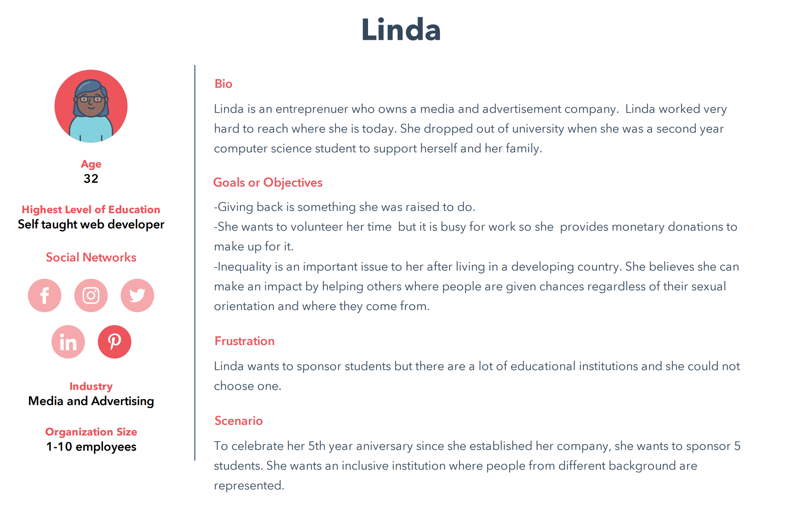

# User Personas

**The project objective**: To work as a group, learning and building home page
for HackYourFutureBelgium website.

<!-- some introduction -->

---

<!-- a persona -->

## Motivated refugee/Newcomer

- **Bio**: Sara is 34 years old , she is a Syrian refugee in Belgium ,she worked
  as a math teacher in her country but also she was a highly interested in IT
  field.

- **Needs/Goals**: She is looking for a programming course, as she wants to
  become a web developer.

- **Frustrations**: She faced many challenges through her search trip:

1. Languages: she does not speak one of the three official languages in Belgium,
   as well she speaks English fluently.
2. Availability: As she is a housewife and a mother of two children, she
   searches of a flexible work time.
3. Budget: she is looking for a free course or a low-cost course.
4. Skills: She is a beginner in programming (she has a very limited knowledge in
   programming).

- **Scenario 1**: Sara is a newcomer in Belgium and as her new situation she
  really does need to learn coding to begin her future career that she hopes and
  meets her requirements.

## Technical director 💻

- **Bio**: Jill Adams is 39 years old Technical Director in IBM, Brussels. One
  of her job responsibilities is to conduct technical interviews an participate
  in the selection and hiring new IT specialists and interns.

- **Needs/Goals**: As a leader of technical managers, It specialists she has to
  lead on strategy, hiring, coaching high performing team. For new charitable
  start-up needs to recruit a staff of interns who need to work under the
  supervision of senior technical managers and Web Developers.

- **Frustrations**: Main frustration for Jill is high workload, cybersecurity
  threats, team management, hiring and retaining talent.

- **Scenario 1**: Jill has to represent presentation of new start-up with new
  hired talents and interns as soon as possible, so for this moment cooperation
  with Hack Your Future Belgium is the most suitable option. Since students are
  registered for this Web Development course twice a year, and just by this time
  there are graduates, so two companies in win-win position.

## Sponsor

## Volunteer-coach

- **Bio**: Dmytro Chumachenko 35 years old , founder of the Profit IT school in
  Kiev .

- **Needs/Goals**: Dmytro Chumachenko is one of those who teaches a new
  generation of Ukrainian specialists in the field of information technology
  (Front-end,Java,PHP,Python,DevOps,Hi-tech) . He teaches various disciplines at
  the Department of Mathematical Modeling and Artificial Intelligence at the
  National Aerospace University. Zhukovsky (Kiev). At the same time, Dmytro
  conducts educational events at the department within the framework of the
  social project School of IT Professionals “ProfIT”, where successful
  representatives of business, media and politics share their experience with
  students.

- **Frustrations**: Main frustration for Dmytro Chumachenkois moving to a new
  country and not be able to be a coach at school. Dmytro has a main job . But
  he would like to practice his knowledge with people on a volunteer basic.

- **Scenario 1**: Dmytro left his country for 1 year . Currently working in
  Brussels, he is looking for a programming school where he could volunteer and
  share his knowledge. Since he had only experience in his country , he would
  like to improve his teaching skills. And learn something new .
