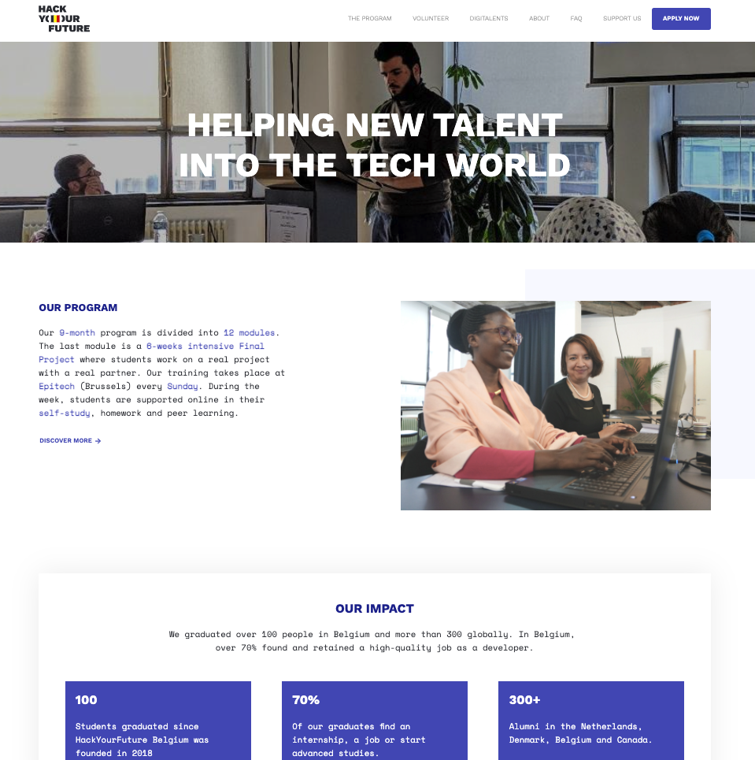
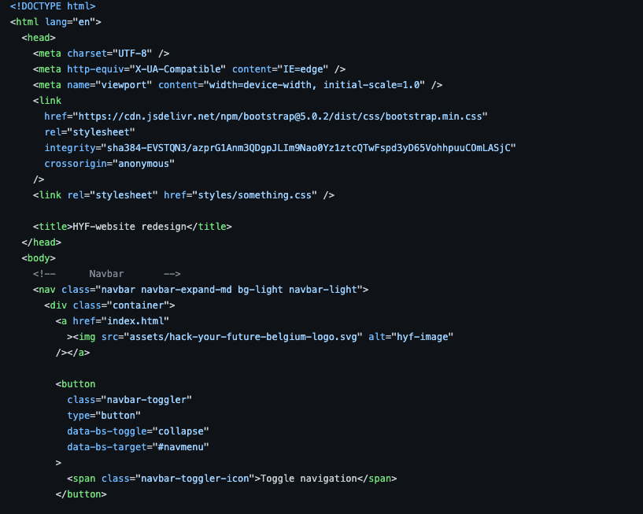

# Re-design of Hack Your Future Website

> In this project, the [Hack Your Future](https://hackyourfuture.be/) website is
> redesigned. The main goal is to implement agile development in practice.
> Proper planning and collaborating with team mates helps the task get done
> easily.

## Table of contents

- [Re-design of Hack Your Future Website](#re-design-of-hack-your-future-website)
  - [Table of contents](#table-of-contents)
  - [General info](#general-info)
  - [Screenshots](#screenshots)
  - [Technologies](#technologies)
  - [Code Examples](#code-examples)
  - [Features](#features)
  - [Status](#status)
  - [Inspiration](#inspiration)
  - [Team Members](#team-members)
  - [Instructions for use](#instructions-for-use)
  - [Code Quality Checks](#code-quality-checks)
  - [Continuous Integration (CI)](#continuous-integration-ci)
  - [Repo Setup](#repo-setup)

## General info

> Hack Your Future in a non-profit organization which helps refugees/new comers
> build digital and soft skills for a career in web development. In this project
> Hack Your Future website is rebuilt to learn mainly planning and
> collaborating, practice agile development and add HTML/CSS skills. The website
> is free to either rebuild or redesign it totally or add additional features.

## Screenshots

## Technologies

- VS code
- HTML
- CSS
- BOOTSTRAP v5.0

## Code Examples

## Features

- _Responsive website_
- _Recreated with HTML and CSS only (+ bootstrap v5.0)_

-

## Status

Project is: _in progress_

## Inspiration

Project by [Hack Your Future](https://hackyourfuture.be/)

## Team Members

1. [Nazgul](https://github.com/NazgulM)
2. [Inna](https://github.com/inna9Z)
3. [Maha](https://github.com/MahaLubbad)
4. [Ali](https://github.com/alihaidermalik20)
5. [Shewit](https://github.com/Shewitttt)

## Instructions for use

  
Getting Started

<!-- a guide to using this repository -->

1. `git clone git@github.com:HackYourFutureBelgium/template-markdown.git`
2. `cd template-markdown`
3. `npm install`

## Code Quality Checks

- `npm run format`: Makes sure all the code in this repository is well-formatted
  (looks good).
- `npm run lint:ls`: Checks to make sure all folder and file names match the
  repository conventions.
- `npm run lint:md`: Will lint all of the Markdown files in this repository.
- `npm run lint:css`: Will lint all of the CSS files in this repository.
- `npm run validate:html`: Validates all HTML files in your project.
- `npm run spell-check`: Goes through all the files in this repository looking
  for words it doesn't recognize. Just because it says something is a mistake
  doesn't mean it is! It doesn't know every word in the world. You can add new
  correct words to the [./.cspell.json](./.cspell.json) file so they won't cause
  an error.
- `npm run accessibility -- ./path/to/file.html`: Runs an accessibility analysis
  on all HTML files in the given path and writes the report to
  `/accessibility_report`

## Continuous Integration (CI)

When you open a PR to `main`/`master` in your repository, GitHub will
automatically do a linting check on the code in this repository, you can see
this in the[./.github/workflows/lint.yml](./.github/workflows/lint.yml) file.

If the linting fails, you will not be able to merge the PR. You can double check
that your code will pass before pushing by running the code quality scripts
locally.

## Repo Setup

- Give each member _write_ access to the repo (if it's a group project)
- Turn on GitHub Pages and put a link to your website in the repo's description
- Turn on GitHub Actions
- in the _Branches_ section of your repo's settings make sure:
  - The repository
    [requires a review](https://github.blog/2018-03-23-require-multiple-reviewers/)
    before pull requests can be merged.
  - The `master`/`main` branch must "_Require status checks to pass before
    merging_"
  - The `master`/`main` branch must "_Require require branches to be up to date
    before merging_"

